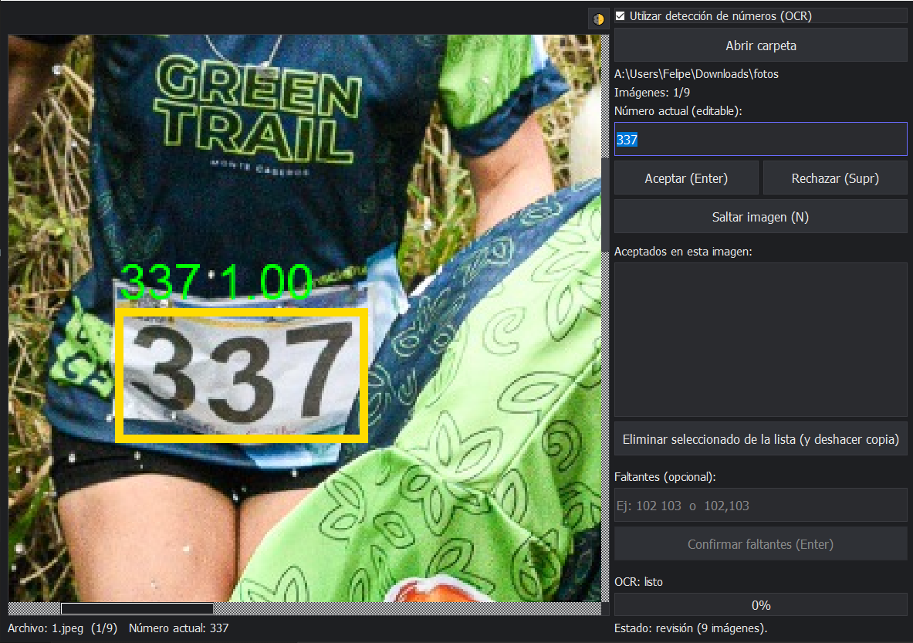

# Real Vision OCR

Aplicación de escritorio desarrollada en Python para detectar y organizar automáticamente números dentro de imágenes utilizando tecnología OCR (Reconocimiento Óptico de Caracteres).

## Problema que resuelve

En muchos contextos, como eventos deportivos, competiciones o registros fotográficos, es común tener que organizar manualmente cientos o miles de imágenes según el número que aparece en ellas (por ejemplo, el dorsal de un participante).

Este proceso manual implica:

- Abrir cada imagen individualmente
- Identificar visualmente el número
- Renombrar o mover el archivo
- Clasificarlo en la carpeta correspondiente

Este procedimiento puede tomar horas o incluso días, y es propenso a errores humanos.

## Solución

Real Vision OCR automatiza completamente este proceso.

La aplicación permite:

- Cargar una imagen
- Detectar automáticamente el número presente mediante OCR
- Clasificar y organizar las imágenes en carpetas correspondientes según el número detectado
- Reducir el tiempo de organización de horas a segundos

Esto permite procesar grandes volúmenes de imágenes de forma rápida, precisa y sin intervención manual.

## Vista previa



La interfaz permite cargar imágenes y visualizar el número detectado automáticamente.

## Características principales

- Interfaz gráfica simple e intuitiva
- Detección automática de números en imágenes
- Organización automática de archivos
- Procesamiento rápido y eficiente
- Reducción significativa del trabajo manual

## Tecnologías utilizadas

- Python
- PyQt5 (interfaz gráfica)
- EasyOCR (detección de texto)
- OpenCV (procesamiento de imágenes)

## Instalación

Instalar las dependencias necesarias:

```
pip install -r requirements.txt
```

## Ejecución

Ejecutar la aplicación:

```
python app/app_gui_ocr.py
```

## Caso de uso típico

Antes:
- 500 imágenes sin organizar
- 2–4 horas de trabajo manual

Después:
- Organización automática en minutos
- Clasificación precisa en carpetas por número

## Autor

Felipe Dengl Berta